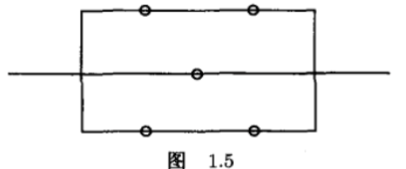

##### 1.6 独立性 P24: 68, 71, 74, 77, 79  

68.如果A和B独立，B与C独立，那么A和C亦独立。如果该陈述为假，请给出反例，否则证明之。

71.证明：如果A，B和C相互独立，那么$A\cap B$ 和C是独立的，$A\cup B$和C是独立的。

74.如果每个单元独立地工作,且失效的概率是p, 那么下面的系统正常工作的概率是多少(见图 1.5)?

77.玩家向目标扔飞镖。每次试验都独立地进行，他命中靶心的概率是0.05。他扔多少次才能使命中靶心至少一次的概率为0.5？

79.很多人类疾病是遗传的（例如，血友病或泰萨二氏病）。这里是此类疾病的一个简单模型。基因型aa是有病的，在交配之前死亡。基因型Aa是一个携带者，但是没有病。基因型AA不是携带者，也没有病。
a. 如果两个携带者交配，他们的后代是这三种基因型之一的概率分别是多少？

b. 如果两个携带者的男性后代没有疾病，他是疾病携带者的概率是多少？

c. 假设b项的无病后代与没有家族病史的个体交配，并设其配偶是病毒携带者的概率是p（p是一个非常小的数）。那么他们的第一代具有基因型AA，Aa和aa的概率是多少？

d. 假设c项的第一代没有疾病，那么基于此证据，其父辈是病毒携带者的概率是多少？

##### 1.6 补充题

1.设两个独立事件 A 和 B 都不发生的概率为 1/9, A 发生 B 不发生的概率与 B 发生 A 不发生的概率相同，求事件 A 发生的概率

2.设两两相互独立的三事件$A,B,C$满足条件：$ABC=\phi,P(A)=P(B)=P(C)$ ,且已知$P(A\cup B\cup C)=9/16$ ,求$P(A).$

##### 2.1 离散随机变量 P46：1，15，31
1.假设$X$是离散随机变量，具有$P(X=0)=0.25$,$P(X=1)=0.125$,$P(X=2)=0.125$和$P(X=3)=0.5$.画出 X 的频率函数和累积分布函数.

15.两队 A 和 B 进行系列赛，如果 A 队赢得比赛的概率为 0.4,那么对他有利的是 5 局 3 胜制还是 7 局 4胜制？假设连续比赛的结果是相互独立的

31.在某些居住地，每小时内的被叫电话次数服从参数为$\lambda=2$的泊松过程
a.如果 Diane 洗浴 10 分钟，期间电话铃声响起的概率是多少？
b.如果她希望没有被叫电话的概率最多为 0.5,那么她可以洗浴多长时间？

##### 2.1 补充题
1.设随机变量$X$的频率函数为：$\quad$求$c$的值。
$$P(X=x)=c\Bigg(\frac{2}{3}\Bigg)^x,\quad x=1,2,3$$

2.设随机变量$X$服从泊松分布，求$k$使$P(X=k)$达到最大。

3.设在 15 只同类型零件中有 2 只为次品，在其中取 3 次，每次任取 1 只，作不放回抽样，以$X$ 表示取出的次品个数，求：
(1) $X$的 分 布 律 ;
(2) $X$ 的 分 布 函 数 并 作 图 ;

$$(3)P\{X\leq\dfrac{1}{2}\},P\{1<X\leq\dfrac{3}{2}\},P\{1\leq X\leq\dfrac{3}{2}\},P\{1<X<2\}\:.$$

4.有 2500 名同一年龄和同社会阶层的人参加了保险公司的人寿保险.在一年中每个人死亡的概率为 0.002,每个参加保险的人在 1月 1 日须交 12 元保险费，而在死亡时家属可从保险公司领取 2000 元赔偿金.求

(1)保险公司亏本的概率;

(2)保险公司获利分別不少于 10000元、20000元的概率.
