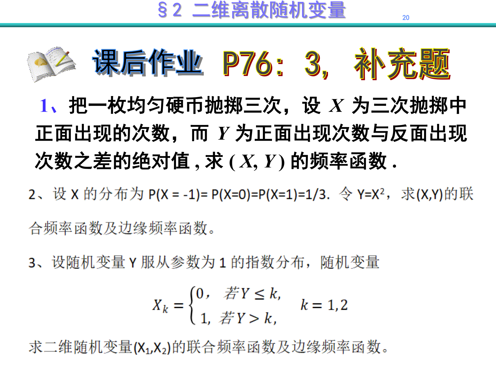
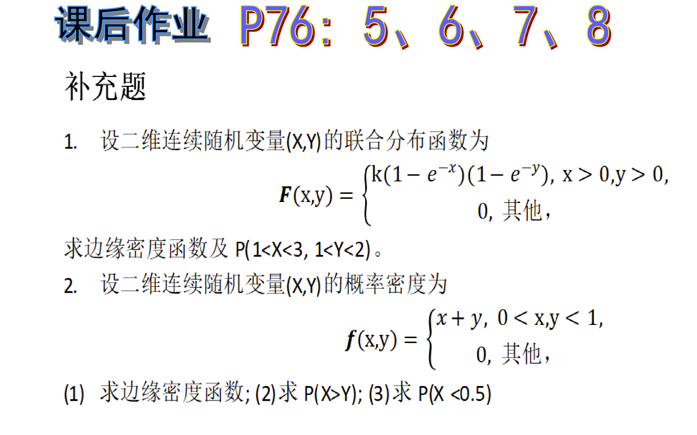

P76 Q3 附加题；P76 Q5,6,7,8 附加题

P76 Q3.三个玩家进行 10 轮独立的游戏，每个人在每轮游戏中获胜的概率都是 $\begin{align}\frac{1}{3}\end{align}$。计算每个人赢得游戏次数的联合分布。

---

1.把一枚均匀硬币抛掷三次，设 $X$ 为三次抛掷中正面出现的次数，而 $Y$ 为正面出现次数与反面出现次数之差的绝对值，求 $(X, Y)$ 的频率函数。

---

2.设  X  的分布为 
$\begin{align}P(X=-1) = P(X=0) = P(X=1) = \frac{1}{3}\end{align}$
令 $Y = X^2$ ，求 $(X, Y)$ 的联合频率函数及边缘频率函数。

---

3.设随机变量 $Y$  服从参数为 $1$ 的指数分布，随机变量
$$X_k = \begin{cases}
0, & \text{若 } Y \leq k, \\
1, & \text{若 } Y > k,
\end{cases} \quad k = 1, 2 $$

求二维随机变量 $(X_1, X_2)$ 的联合频率函数及边缘频率函数。

---

5.(蒲丰投针问题)平面上面有一些平行线，它们之间的距离都是 $D$，一根长为 $L$ 的针随机地投在平面上，其中 $D \geqslant L$。证明：此针正好与一条直线相交的概率是 $\frac{2L}{\pi D}$。解释为什么这个实验能够机械地估计 $\pi$ 值。

---

6.从椭圆内部随机地选择一个点，椭圆方程为：
$$\frac{x^2}{a^2} + \frac{y^2}{b^2} = 1$$
计算该点坐标 \(x\) 和 \(y\) 的边际密度。

---

7.计算相应于如下 CDF 的联合密度和边际密度
$$F(x, y) = \left(1 - e^{-\alpha x}\right)\left(1 - e^{-\beta y}\right), \quad x \geqslant 0, \quad y \geqslant 0, \quad \alpha > 0, \quad \beta > 0 $$

---

8.若 \(X\) 和 \(Y\) 具有联合密度
$f(x, y) = \frac{6}{7}(x + y)^2, \quad 0 \leqslant x \leqslant 1, \quad 0 \leqslant y \leqslant 1$

a. 利用合适区域上的积分，计算 $(i)P(X > Y), (ii) P(X + Y \leqslant 1), (iii) P\left(X \leqslant \frac{1}{2}\right)$。

b. 计算 \(x\) 和 \(y\) 的边际密度。

c. 计算这两个变量的条件密度。

---

附加题 Q1.设二维连续随机变量 \((X,Y)\) 的联合分布函数为
$\begin{aligned}F(x, y)=\left\{\begin{array}{c} k(1-e^{-x})(1-e^{-y}), & x>0, y>0,\\ 0, & \text{其他}\end{array}\right.\end{aligned}$ 
求边缘密度函数及 $P(1<X<3,1<Y<2)$ 。

---

2.设二维连续随机变量 \((X,Y)\) 的概率密度为
$f(x, y)=\left\{\begin{array}{c} x+y, & 0<x, y<1,\\ 0, & \text{其他}\end{array}\right.$

1. 求边缘密度函数；

2. 求 \( P(X>Y) \)；

3. 求 \( P(X<0.5) \)。

---

